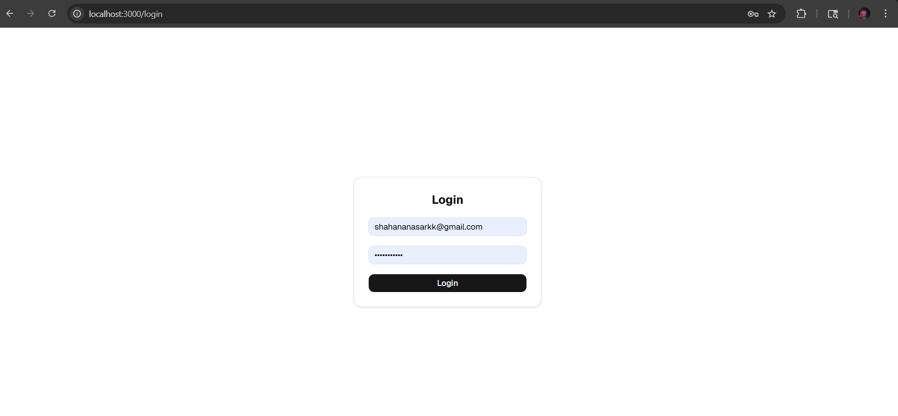
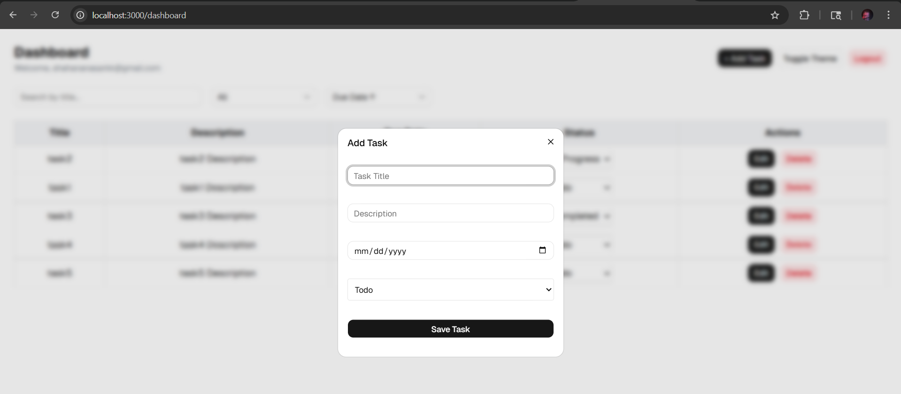
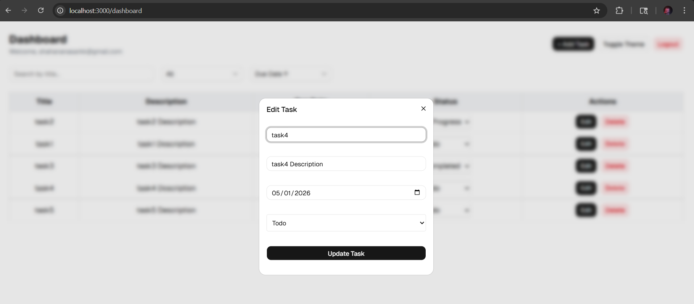
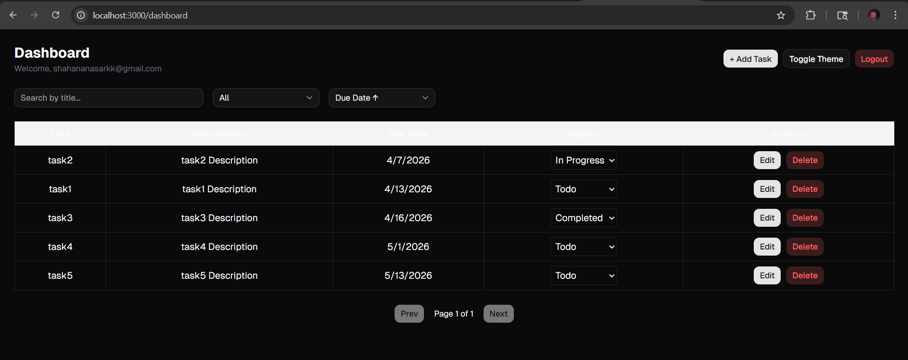
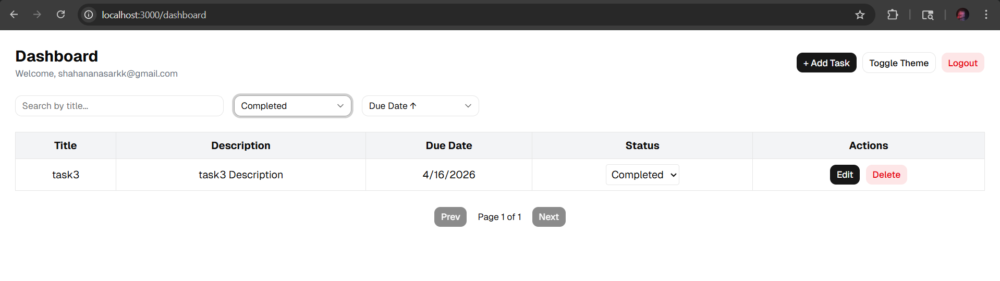
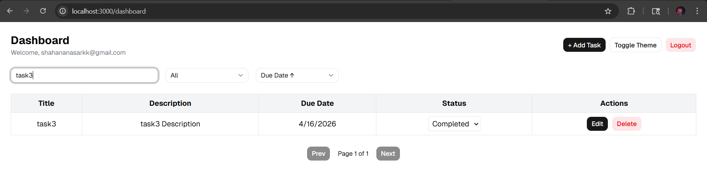

# Next.js Task Dashboard

A simple **Task Management Dashboard** built with **Next.js**, **TypeScript**, **Tailwind CSS**, and **shadcn/ui**.  
This app demonstrates CRUD functionality, filtering, sorting, and mock authentication.

---

## Tech Stack
- **Next.js** (App Router)  
- **TypeScript**  
- **Tailwind CSS**  
- **shadcn/ui** (UI components: buttons, modals, inputs)  
- **Local state / Mock API** (no real backend)

---

## Setup Steps

Clone the repository:
```bash
git clone https://github.com/ShahanaNazer12/Nextjs-task-dashboard.git

Navigate to the project folder:
cd task-dashboard

Install dependencies:
npm install

Run the development server:
npm run dev

Open http://localhost:3000
 ```


## Design Decisions

1. Mock Authentication: Kept simple with localStorage to avoid backend complexity.
2. State Management: Used React local state to manage tasks and filters; simple and efficient for this small project.
3. shadcn/ui: Used for modal forms, buttons, and inputs to maintain consistent UI design.
4. TypeScript: Ensures type safety across components and prevents runtime errors.
5. Folder Structure: Modular approach to separate concerns and make the codebase scalable.
6. Tailwind CSS: Provides utility-first styling, responsive layouts, and fast development.

## Folder Structure

task-dashboard/
│
├─ app/                # Next.js App Router pages
│   ├─ dashboard/      # Dashboard page and nested components
│   ├─ login/          # Login page
│
├─ components/         # Reusable UI components (TaskTable, TaskModal, Filter)
├─ lib/                # Utility functions, mock API routes
├─ types/              # TypeScript types for tasks, forms, etc.
├─ public/             # Images, assets
├─ styles/             # Tailwind CSS global styles
├─ screenshots/        # Screenshots for README
├─ package.json
├─ tsconfig.json
├─ tailwind.config.js
├─ README.md


## Screenshots

Login Page:  


Dashboard Page:  


Create Task Modal:  


Edit Task Modal:


DarkMode:


SearchByStatus:


SearchByTitle:



